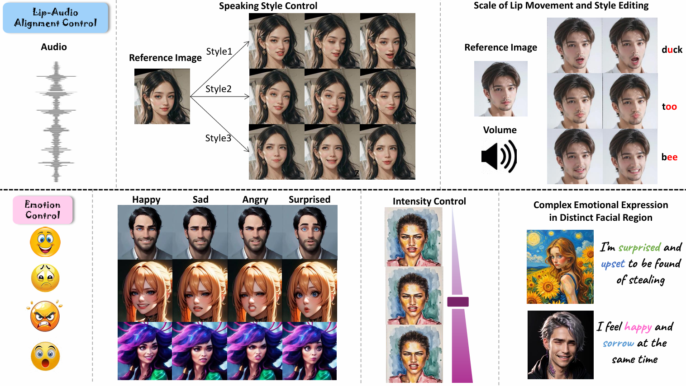

# PC-Talk

Official repository for the CVPR 2026 paper

**PC-Talk: Precise Facial Animation Control for Audio-Driven Talking Face Generation**

<a href="https://scholar.google.cz/citations?user=pBF9Mn8AAAAJ&amp;hl=zh-CN&amp;oi=ao" target="_blank">Baiqin Wang</a><sup>1,2</sup>, <a href="https://xiangyuzhu-open.github.io/homepage/" target="_blank">Xiangyu Zhu</a><sup>1,2,*</sup>, Fan Shen<sup>3</sup>, Hao Xu<sup>3,4</sup>, <a href="https://scholar.google.cz/citations?hl=zh-CN&amp;user=cuJ3QG8AAAAJ" target="_blank">Zhen Lei</a><sup>1,2,5,6</sup>

<sup>1</sup>MAIS, Institute of Automation, Chinese Academy of Sciences, <sup>2</sup>School of Artificial Intelligence, University of Chinese Academy of Sciences, <sup>3</sup>Psyche AI.INC, <sup>4</sup>The Hong Kong University of Science and Technology, <sup>5</sup>CAIR, HKISI, Chinese Academy of Sciences, <sup>6</sup>SCSE, FIE, M.U.S.T

<sup>*</sup>Corresponding author

[](https://arxiv.org/abs/2503.14295)
[](https://bq-wang0511.github.io/PC-Talk/)
[](https://huggingface.co/doubi-killer/PC-Talk)

## Introduction

PC-Talk generates audio-driven talking faces with precise control over
speaking style, lip articulation, and facial emotion.



PC-Talk uses **LAC** for speaking-style and lip-articulation control,
**EMC** for emotion control, and **LivePortrait** for portrait animation.

## Installation

Use **Python 3.10–3.12** (Python 3.10 is recommended). NumPy is constrained to
1.x, and OpenCV is constrained to versions below 4.12 to avoid its NumPy 2.x
requirement. Create a fresh environment and install a PyTorch build suitable
for your platform using the [official PyTorch installer](https://pytorch.org/get-started/locally/).
Then clone the source repository:

```bash
git clone https://github.com/BQ-Wang0511/PC-Talk.git
cd PC-Talk
```

Choose **one** ONNX Runtime backend. These commands also install the core
dependencies from `requirements.txt`:

```bash
# CPU ONNX backend (also suitable for macOS)
pip install -e ".[cpu]"

# OR: NVIDIA GPU ONNX backend
pip install -e ".[gpu]"
```

Do not install both `onnxruntime` and `onnxruntime-gpu`: they provide the same
Python module. When switching backends in an existing environment, first run
`pip uninstall -y onnxruntime onnxruntime-gpu`, then install the chosen extra
above. `requirements.txt` contains only the core dependencies; installing it
alone does not install an ONNX Runtime backend.

For GPU execution, your ONNX Runtime GPU version must match the installed
CUDA/cuDNN libraries and PyTorch build. Consult the
[official CUDA/cuDNN compatibility table](https://onnxruntime.ai/docs/execution-providers/CUDA-ExecutionProvider.html#requirements)
and select a compatible `onnxruntime-gpu` version; the `[gpu]` extra alone does
not configure NVIDIA drivers or system CUDA libraries. The CPU backend runs
face detection and landmarks on CPU even if PyTorch uses a GPU; it does not
force the main PyTorch models to run on CPU. Use the CLI's `--force-cpu`
option for full CPU inference.

Check the installation and available ONNX providers:

```bash
python -m pip check
python -c "import torch, onnxruntime as ort; print('Torch CUDA:', torch.cuda.is_available()); print('ONNX providers:', ort.get_available_providers())"
```

GPU ONNX execution requires `CUDAExecutionProvider` in the provider list;
initialising a model session must also succeed with compatible CUDA/cuDNN
libraries.

FFmpeg and FFprobe must be available on `PATH`. Inference uses 16 kHz mono
audio and produces 25 fps video. Install these system tools separately (for
example, `conda install -c conda-forge ffmpeg`); `imageio-ffmpeg` does not
guarantee both commands are available on `PATH`. Verify with `ffmpeg -version`
and `ffprobe -version`.

## Download and configure checkpoints

Download the pretrained models from
[https://huggingface.co/doubi-killer/PC-Talk](https://huggingface.co/doubi-killer/PC-Talk).

Run the following commands **from the PC-Talk repository root**:

```bash
pip install -U huggingface_hub
hf download doubi-killer/PC-Talk --local-dir pctalk/checkpoints
```

The download preserves the model directory structure. Do not create an extra
`PC-Talk/` or `checkpoints/` folder inside `pctalk/checkpoints`:

```text
pctalk/checkpoints/
├── audio_encoder.pth
├── lac.pth
├── emc.pth
├── style_encoder.pth
├── liveportrait/
│   ├── landmark.onnx
│   ├── base_models/
│   │   ├── appearance_feature_extractor.pth
│   │   ├── motion_extractor.pth
│   │   ├── spade_generator.pth
│   │   └── warping_module.pth
│   └── retargeting_models/
│       └── stitching_retargeting_module.pth
└── insightface/
    └── models/buffalo_l/
        ├── 2d106det.onnx
        └── det_10g.onnx
```

For a manual download, open the Hugging Face repository's **Files and versions**
tab and copy the files into the exact paths shown above, preserving the
`liveportrait/` and `insightface/` subdirectories.

The CLI uses this directory by default; no source-code changes are required.
`lac.pth` contains both the LAC model and its refinement model. `emc.pth` is
used for emotion control, and `style_encoder.pth` is used with reference-style
input. Custom LAC and EMC locations can be passed with `--lac-checkpoint` and
`--emc-checkpoint`.

## Image-driven example

The repository includes `examples/assets/obama.jpg` for the single-image
inference example.

Run it with any speech WAV file:

```bash
./examples/run_image.sh /path/to/speech.wav
```

The equivalent command is:

```bash
python -m pctalk \
  --source examples/assets/obama.jpg \
  --audio /path/to/speech.wav \
  --lac-checkpoint pctalk/checkpoints/lac.pth \
  --emc-checkpoint pctalk/checkpoints/emc.pth \
  --person-id 192 \
  --lip-scale 0.6 \
  --emotion happy:all:0.5 \
  --output-dir outputs/image_example
```

The generated video is saved in `--output-dir`.

Without a motion reference, a source image supplies a static head pose while
LAC and EMC animate its mouth and expression. To borrow head motion from
another image, video, or trusted LivePortrait motion template, optionally add:

```bash
--motion-reference /path/to/reference.mp4
```

## Video-driven example

When `--source` is a video, do not pass `--motion-reference` for normal use.
PC-Talk automatically extracts and preserves the source video's own pose
sequence:

```bash
./examples/run_video.sh /path/to/source.mp4 /path/to/speech.wav
```

Equivalent command:

```bash
python -m pctalk \
  --source /path/to/source.mp4 \
  --audio /path/to/speech.wav \
  --lac-checkpoint pctalk/checkpoints/lac.pth \
  --emc-checkpoint pctalk/checkpoints/emc.pth \
  --person-id 192 \
  --lip-scale 0.6 \
  --emotion happy:all:0.5 \
  --output-dir outputs/video_example
```

Use `--motion-reference` with a video only when intentionally replacing its
pose sequence with another reference.

## Additional inference controls

Reference speaking style and emotion:

```bash
pctalk \
  --source source.jpg \
  --audio speech.wav \
  --style-reference style.mp4 \
  --person-id 192 \
  --lip-scale 0.6 \
  --emotion happy:all:0.5
```

Regional compound emotion and articulation control:

```bash
pctalk \
  --source source.jpg \
  --audio speech.wav \
  --person-id 192 \
  --emotion happy:lips:0.5 \
  --emotion sad:upper_face:0.3 \
  --lip-scale 0.6 \
  --articulation pursing:1.3
```

Useful controls:

- `--person-id N`: select a preset speaking style. Recommended starting IDs
  are `192`, `166`, and `202`; they produce different learned articulation
  styles from the bundled LAC checkpoint.
- `--emotion EMOTION[:REGION[:INTENSITY]]`: apply EMC with a default intensity
  of `0.5`; keep values near or below `0.5` for restrained expressions.
- `--motion-reference`: use another image, video, or trusted motion pickle for
  the base pose.
- `--articulation NAME:SCALE`: edit `pursing`, `widening`, or `opening`; the
  option may be repeated.

## Citation

If you find PC-Talk useful in your research, please cite:

```bibtex
@inproceedings{wang2026pc,
  title     = {PC-Talk: Precise Facial Animation Control for Audio-Driven Talking Face Generation},
  author    = {Wang, Baiqin and Zhu, Xiangyu and Shen, Fan and Xu, Hao and Lei, Zhen},
  booktitle = {Proceedings of the IEEE/CVF Conference on Computer Vision and Pattern Recognition},
  pages     = {25153--25162},
  year      = {2026}
}
```

## Acknowledgements

PC-Talk builds on ideas and implementation foundations from the following
open-source projects. We sincerely thank their authors and contributors:

- [LivePortrait](https://github.com/KwaiVGI/LivePortrait) provides the portrait
  animation, warping, stitching, retargeting, and rendering backbone.
- [FaceFormer](https://github.com/EvelynFan/FaceFormer) inspired the
  transformer-based autoregressive facial-motion modeling components.
- [Wav2Lip](https://github.com/Rudrabha/Wav2Lip) provides the foundation for
  the audio feature encoder and mel-spectrogram preprocessing design.

## License

See [LICENSE](LICENSE) and [THIRD_PARTY_NOTICES.md](THIRD_PARTY_NOTICES.md).
InsightFace model assets are restricted to non-commercial research use.
